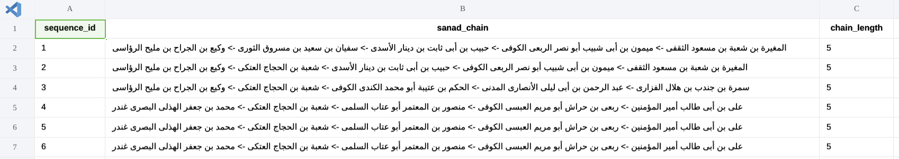
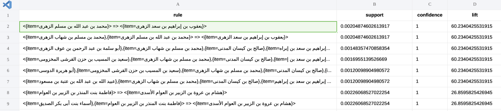
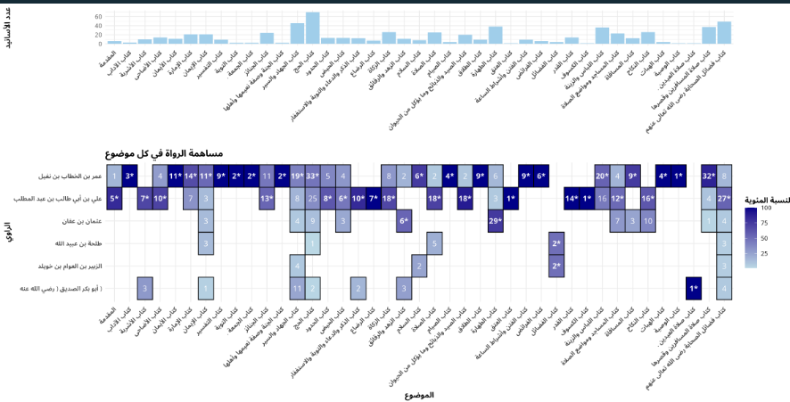
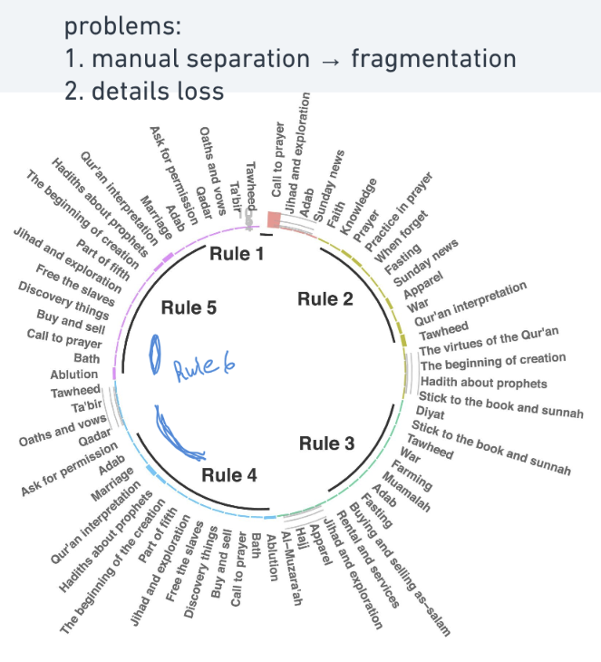

# Muslim book
## **Project Objective**

provided a specific (min support, min confidence, min lift) values, this project can do the following:

* for selected narrators:

  * produce a narrator_theme graph overview
  * produce a cspade rules file
  * produce a sanads file (narrator 1 -> narrator2 -> etc.)
* for all narrators in the book:

  - produce a cspade rules file

  * produce a sanads file (narrator 1 -> narrator2 -> etc.)

---

# The code

## 1. **Data Import and Preparation**

* Loads 3 CSVs:
  * `IsnadData`: contains narrator links and interaction labels
  * `HadithContentData`: contains book/chapter metadata
  * `NarratorsData`: contains narrator IDs and details
* Merges and filters data based on selected narrator IDs (if the chosen mode = advanced analysis)
* Assigns:
  * `sequence_id`: groups narrations into individual sanad chains
  * `event_id`: extracts order from `interactionLabel`
  * `item`: uses narrator names as items for SPADE

## **2. Key Helper Functions**

### `graphing_themes(counts)`

* Plots:
  * Bar chart: top themes per narrator
  * Heatmap: narrator vs. chapter contribution
* Uses **patchwork** to arrange plots
* Returns a `ggplot` object (can be saved using `ggsave()`)

---

### `applying_spade(sequence_id, event_id, item, support, confidence, lift)`

* Runs the **cSPADE** algorithm from `arulesSequences`
* Generates rules using `ruleInduction()`
* Computes quality metrics including lift
* Returns rules (filtered/sorted externally)

---

### `generate_sanad_chains(sequence_id, event_id, item)`

* Produces readable sanad chains:
  * `"A → B → C"` per hadith
* Returns data frame with chains and lengths

---

### `choose(prompt, choices, multiple_choices)`

* Console UI for menu selection
* Lets users pick options interactively

---

## **3. Main Program Logic (Looped Menu)**

### 1. **Welcome Menu**

* Options:
  * Advanced analysis for selected narrators
  * General analysis for all narrators
  * Exit

---

### 2. **Advanced Analysis (selected narrators)**

* User inputs narrator IDs
* Extracts **all hadiths involving them**
* Merges to get **all other narrators** in those hadiths
* Options:
  * **Theme graph** (via `graphing_themes`)
  * **SPADE rules** (via `applying_spade`)
  * **Sanads file** (via `generate_sanad_chains`)

---

### 3. **General Analysis (all narrators)**

* Applies the same tools but on the **full dataset**
* No filtering by narrator (and no graph option)

---

## **Outputs Produced**

* `.csv` ( separator = tab "\\t") of **sanad chains**
* `.csv` of **SPADE rules** with support/confidence/lift
* `.png`  **theme visualizations** per narrator

---

# Notes

## why the project works this way?

1. The project is a console application but it contains central logic as pure functions so that any one can benefit from them
2. The (sanad) generation feature will be useful if we tried to make a frontend app and someone wanted to see the actual sanads were the narrators relate to each other. the (sanad) file generated have the following format (in this example): .. the sequence_id is the sanad number in the context of the whole book (not the hadith number because each hadith contains multiple sanads)
3. Spade algorithm is used in the project to produce (rules) and it was needed to make the file containing these rules (tab separated) not (comma separated) because the values themselves contain commas. here is an example showing the expected output inside the column (rule) you can find items (Narrators) separated by (=>) if the first item is in a level and the other is in the next level. Items separated by (commas) are in the same level
4. As an example for the graphs produced by this project: .. in the top graph, you can see the number of (sanads) that the (selected narrators) have narrated. In the bottom one, each narrator is shown horizontally and the topic (aka: theme or book chapter name) they have narrated vertically. each cell in the bottom graph contains the number of (sanads) narrated by this narrator in this topic. the cells that have astrek (*) inside them are the TOP contributions in that specific topic

## considerations

1. In the advanced analysis mode (aka: for selected IDs), the sanad and rules file will use (only) the Narrator_IDs selected not all the Narrator_IDs in the hadiths related to each selected Narrator_ID
2. In the advanced analysis mode (aka: for selected IDs), the graph shows the number of sanads the narrator appears at not the number of hadiths
3. NarratorID is used as input by the user but the field that appears in the results is NarratorsData( NarratorNameAr ) not (NarratorNameAr-Mapped) because the later ruins the (sanad), (rules) files format when used

## why so late ?

1. The langauge (R) is very new to me so I did have to learn everything I need for this project (including basics, graphs, IO, etc.)
2. I've tried multiple graphs to produce the most suitable one for that case ... and it was not the circular one (that's used in the SPADE algorithm paper) because it's done manually (if I tried to make the logic automatic it will cause fragmentation as in the following graph) + there is a ton of details lost
3. I've tried to make the code detailed and functional as possible (pure functions)
